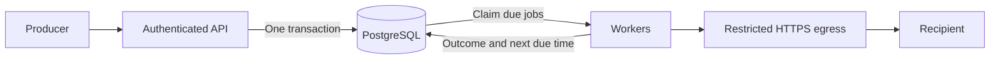

# Worked example: a webhook service a three-person team can operate

## Decision and assumptions

Start with PostgreSQL as the durable acceptance boundary and work queue. Run two stateless API instances and two worker processes across availability zones, using the existing database's managed high-availability configuration. Remain in one region. This recommendation is conditional on load testing and sufficient database headroom.

Assume one registered destination per event, a 1 KiB average payload, 100 accepted events/second sustained, and a 60-second burst at 1,000/second. Payloads have a 64 KiB hard limit. Multiple destinations multiply delivery volume; reassess capacity before enabling fan-out.

The 99.9% availability target covers authenticated ingestion, including durable acceptance. Over 30 days, that permits about 43 minutes of unavailability. Recipient downtime is tracked separately. Healthy recipients should receive 95% of events within five seconds under normal load. Neither latency nor throughput is a measured result yet.

At 100 events/second, 30 days means 259.2 million events and roughly 265 GB of raw 1 KiB payloads, before indexes, metadata, WAL, backups, and replicas. Retention is a first-release capacity requirement.

## Two credible options

| Option | Benefit | Cost and failure boundary |
|---|---|---|
| PostgreSQL queue | Acceptance, audit record, and scheduling commit atomically; one existing operational system | Polling, updates, vacuum, and retention compete with the existing workload |
| Broker plus PostgreSQL | Independent queue capacity and delivery scheduling | Requires an outbox/relay or equivalent to avoid losing work between database and broker; another system to operate |

Choose PostgreSQL first because the team already operates it. Approve production only after testing the combined workload. A broker becomes worthwhile when queue traffic threatens database latency or independent scheduling capacity is necessary.

## Data and ownership

| Record | Essential fields and invariant |
|---|---|
| `endpoint` | tenant, ID, HTTPS URL, configuration version, signing-secret reference; tenant owns configuration |
| `receipt` | tenant, idempotency key, request hash, event ID, expiry; unique `(tenant, key)` during a documented 24-hour deduplication window |
| `event` | tenant, event ID, accepted time, payload, destination version; immutable, daily partitions retained for 30 days |
| `job` | event ID, due time, attempt count, state, lease token, lease expiry; only active delivery work |
| `delivery_audit` | event ID, attempt number, timestamps, outcome, bounded error code; daily partitions retained for 30 days |

Store a destination snapshot so edits cannot silently redirect accepted events. Store secrets separately; audit records never contain credentials or response bodies. Encrypt payload storage and authorize audit queries by tenant.

The ingestion transaction creates the receipt, event, and job before returning `202`. A duplicate key with the same request hash returns the original event ID; a different hash returns `409`. Concurrent requests resolve through the unique constraint. An expired key may create a new event: deduplication is explicitly bounded.

## State transitions and delivery semantics

Jobs transition `pending → leased → succeeded`, or `leased → pending` with a future due time. Permanent failures and exhausted retry budgets transition to `dead`. Success and dead outcomes append audit records and remove active jobs atomically. A lease timeout makes unfinished work claimable again.

Claim a bounded batch using `FOR UPDATE SKIP LOCKED`, assign fresh lease tokens, and commit before making HTTP requests. Finalization must match the token, preventing an expired worker from overwriting a newer attempt. Tokens protect database state; they cannot undo an HTTP request already sent.

Send a stable event ID and timestamped HMAC signature. Treat `2xx` as acknowledged. Retry timeouts, connection failures, `408`, `429`, and `5xx`, using exponential backoff with jitter and a capped `Retry-After`. Other `4xx` responses become dead deliveries. Disable redirects. Stop automated retries after 24 hours or 20 attempts, whichever comes first; expose failures and authorized manual replay in the audit UI.

A worker can crash after recipient success but before recording it. Redelivery is therefore expected. Recipients must deduplicate the stable event ID. “At least once” describes retry behavior, not guaranteed success against an unavailable recipient. Ordering is not promised.

## Backpressure and the HTTP trust boundary

Begin with 50 global requests in flight, ten per destination, and a five-second total request timeout. These are tunable starting limits. Isolate noisy tenants through admission quotas and bounded worker batches. Return `429` before acceptance when the queue exceeds its tested capacity; never discard acknowledged events. Alert on oldest due-job age and per-endpoint retry volume, not queue length alone.

Only authenticated tenants can register endpoints. Permit HTTPS on port 443; reject embedded credentials and nonpublic destinations. Validate all resolved IPv4/IPv6 addresses and pin the validated connection address while retaining hostname verification for TLS. Enforce network-level denial of loopback, private, link-local, and metadata destinations. Recheck on every connection; URL validation alone cannot stop DNS rebinding. Bound response bytes and redact logs.

## Evidence required before launch

On fixed production-like resources, run 100 requests/second for an hour and 1,000/second for 60 seconds with realistic payloads. Require ingestion p95 below 200 ms, no unexplained missing accepted events, and no existing-database SLO regression. Then kill workers before and after HTTP acknowledgment; verify recovery, observable duplicates, and successful recipient deduplication. Test duplicate ingestion races, slow recipients, malicious endpoint URLs, and retention deletion.

If workers demonstrate 300 successful deliveries/second, the assumed burst adds approximately 42,000 jobs and drains in 210 seconds after traffic returns to 100/second. This is capacity arithmetic to test, not a benchmark. Verify backup restoration and zone failover against the availability budget.

## Upgrade and rollback

Investigate a broker when healthy-destination queue age exceeds five minutes during tested bursts, or queue work repeatedly breaches database latency targets. Migrate by tenant: relay transactional outbox entries, preserve event IDs, and assign exactly one active scheduler per tenant. Roll back by pausing that tenant's broker scheduler, reconciling unfinished jobs from durable records, and re-enabling database scheduling. Expect duplicates during reconciliation; never erase accepted work.

## AOSA precedents and limits

The [Berkeley DB chapter by Margo Seltzer and Keith Bostic](https://aosabook.org/en/v1/bdb.html) motivates making durability ordering explicit; the [Graphite chapter by Chris Davis](https://aosabook.org/en/v1/graphite.html) motivates bounded buffering under storage pressure; the [Twisted chapter by Jessica McKellar](https://aosabook.org/en/v2/twisted.html) motivates explicit asynchronous completion and error paths. Applying these lessons to PostgreSQL jobs and HTTP delivery is our design inference. The chapters do not validate this implementation, its capacity, or current PostgreSQL configuration.
